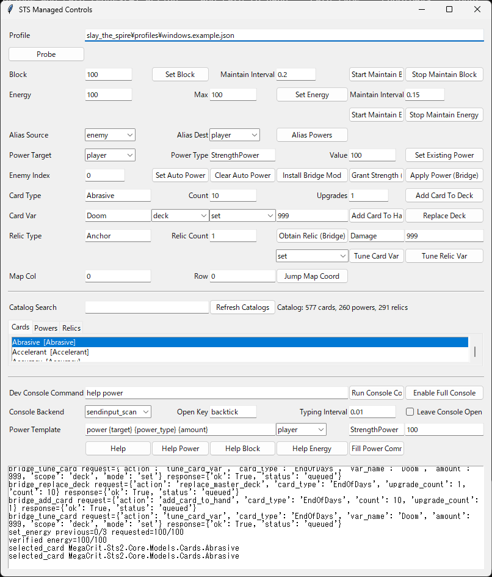

# STS Managed Controls

Local single-player runtime toolkit for Slay the Spire 2. Inspect live managed state, change gold/block/energy, apply powers, add cards, obtain relics, and run bridge-based in-process actions from a desktop UI.


## What This Release Is

This public release is centered on `STS Managed Controls`.

It is intended for:

- single-player sandbox use
- mod authors
- testers and balance iteration
- debugging live game state without OCR-only workflows

## Core Features

- Probe live state through the managed CLR snapshot path.
- Read floor, ascension, HP, block, gold, and energy without OCR.
- Set gold directly.
- Set or maintain block.
- Set or maintain energy.
- Apply powers through the bridge mod.
- Search cards, powers, and relics discovered from `sts2.dll`.
- Add cards to hand or deck.
- Add upgraded cards with `upgrade_count`.
- Replace the master deck.
- Obtain relics.
- Set combat-start auto powers.
- Jump to map coordinates.
- Tune selected card or relic dynamic vars.
- Run everything from a local GUI instead of typing repeated commands.

## Current Status

Stable enough to ship as the main surface:

- managed control UI
- probe-managed
- gold / block / energy controls
- bridge power apply
- bridge add card to hand
- searchable card / power / relic catalog

Still experimental:

- add card to deck
- replace master deck
- obtain relics
- map jump
- dynamic-var tuning

## Quick Start

Create the environment:

```powershell
python -m venv .venv
.venv\Scripts\Activate.ps1
pip install -e .
pip install pytesseract
```

Write or reuse a live profile:

```powershell
python -m sts_bot.cli write-example-profile
```

Launch the control panel:

```powershell
python -m sts_bot.cli managed-control-ui --profile profiles\windows.example.json
```

Useful CLI entrypoints:

```powershell
python -m sts_bot.cli probe-managed --profile profiles\windows.example.json
python -m sts_bot.cli set-managed-gold --profile profiles\windows.example.json --value 999
python -m sts_bot.cli set-managed-block --profile profiles\windows.example.json --value 100
python -m sts_bot.cli set-managed-energy --profile profiles\windows.example.json --value 10 --max-value 10
python -m sts_bot.cli list-game-catalog --kind cards --query whirlwind
```

## GUI Overview

The desktop control panel is the main public entrypoint for the current release.



## Bridge Workflow

Install the local bridge mod:

```powershell
python -m sts_bot.cli install-bridge-mod
```

Restart the game once after installation, then use bridge commands such as:

```powershell
python -m sts_bot.cli bridge-apply-power --power-type StrengthPower --value 100 --target player
python -m sts_bot.cli bridge-add-card --card-type Whirlwind --destination hand --count 1 --upgrade-count 1
python -m sts_bot.cli bridge-set-auto-power --power-type PlatingPower --value 999 --target player
python -m sts_bot.cli bridge-obtain-relic --relic-type Anchor --count 1
```

## Trial And Unlock

Each install starts with a 30-minute trial.

- after expiry, managed write and bridge actions are blocked
- activate unlimited access with a signed activation key issued for your install id
- open the purchase page from the GUI `License` menu or via CLI when `STS_MANAGED_CONTROLS_PURCHASE_URL` is configured

Commands:

```powershell
python -m sts_bot.cli managed-controls-license-status
python -m sts_bot.cli activate-managed-controls --license-key <KEY>
python -m sts_bot.cli open-managed-controls-purchase
python -m sts_bot.cli open-managed-controls-activation-guide
```

## Troubleshooting

Bridge pipe unavailable:

- install the bridge mod
- restart the game
- confirm the game loaded the mod

Bridge DLL locked during install:

- fully close the game
- run `install-bridge-mod` again

No profile found:

- use an absolute path, or run from the repo root

Power not found:

- `set-managed-power` only edits an already-existing power
- use `bridge-apply-power` when you need in-process creation

## Safety

Use this on local single-player runs.

- Back up saves if you care about them.
- Modded runs and experimental bridge actions can leave saves or combat state in unusual conditions.
- Game updates may break reflection-based bridge calls.

## Documentation

Operator notes:

- `docs/workstreams/managed_runtime_controls.md`

Release planning:

- `docs/release/release_runbook.md`
- `docs/release/public_release_checklist.md`
- `docs/release/listing_copy.md`
- `docs/release/license_fulfillment.md`

Bundled media:

- `docs/release/managed-controls-demo.gif`
- `docs/release/gui.png`
- `docs/release/Slay the Spire 2 - 2026-04-03 21-21-07.mp4`
- `docs/release/Slay the Spire 2 - 2026-04-05 18-24-09.mp4`

## Positioning

- local modding and debugging toolkit
- single-player runtime control panel
- sandbox for testing cards, powers, relics, and combat setups
